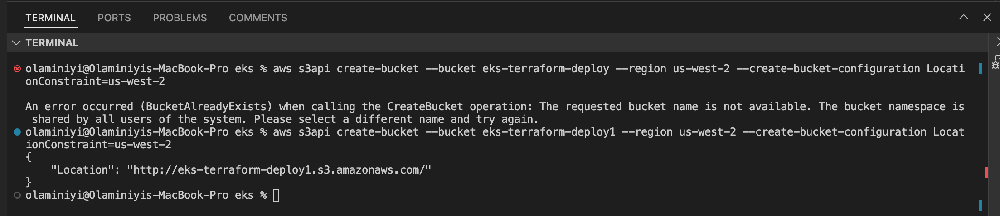

# 24.Setting up EKS with Terraform Deploying Jenkins Server using Helm

In this extensive project, our primary emphasis will be on the practical real-world implementation of Kubernetes deployment and management. This involves a series of tasks geared toward guaranteeing the resilience and scalability of our system. The key objectives include:

- I plan to employ Terraform to establish a Kubernetes EKS cluster and dynamically integrate adaptable worker nodes into the system.

- Furthermore, I intend to deploy multiple applications using HELM, leveraging Kubernetes objects in conjunction with Helm. This approach includes dynamic provisioning of volumes to enable stateful pods.

- Finally, I will execute the deployment process via CI/CD using Jenkins.

### Building EKS with Terraform

Create a directory on your local machine - eks and create an s3 bucket

 mkdir eks && cd eks

 aws s3api create-bucket --bucket eks-terraform-deploy --region us-west-2

 ### Errors
 1. after running this command 'aws s3api create-bucket --bucket eks-terraform-deploy --region us-west-2' i got this error 

"An error occurred (IllegalLocationConstraintException) when calling the CreateBucket operation: The unspecified location constraint is incompatible for the region specific endpoint this request was sent to."

- i resolved it by adding the LocationConstraint, like this: 
aws s3api create-bucket --bucket eks-terraform-deploy1 --region us-west-2 --create-bucket-configuration LocationConstraint=us-west-2
